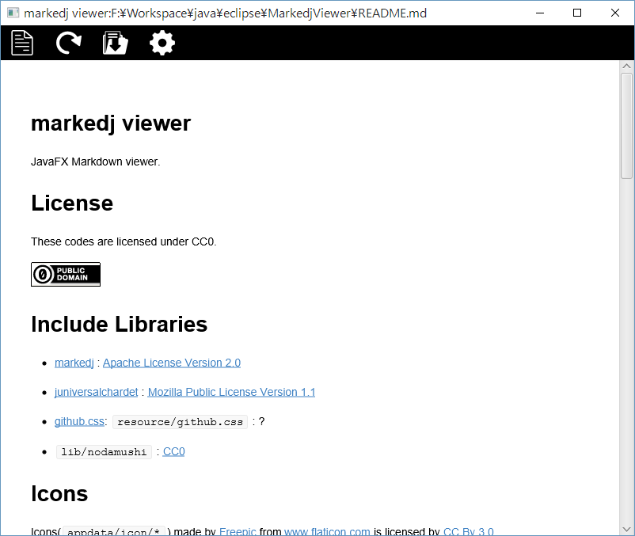

# markedj viewer

JavaFX Markdown viewer.



# License


These codes are licensed under CC0.

[](http://creativecommons.org/publicdomain/zero/1.0/deed.ja)

# Include Libraries

+ [markedj](https://github.com/gitbucket/markedj/blob/master/LICENSE, "markedj") : [Apache License Version 2.0](http://www.apache.org/licenses/)
+ [juniversalchardet](https://code.google.com/p/juniversalchardet/,"juniversalchardet") : [Mozilla Public License Version 1.1](https://www.mozilla.org/en-US/MPL/1.1/)
+ [github.css](https://gist.github.com/andyferra/2554919,"githb.css"): ```resource/github.css``` : ?
+ ```lib/nodamushi``` : [CC0](http://creativecommons.org/publicdomain/zero/1.0/deed.ja)


# Icons

Icons(```appdata/icon/*```) made by [Freepic](http://www.freepik.com , "Freepik") from [www.flaticon.com](http://www.flaticon.com,"Flaticon")  is licensed by [CC By 3.0](http://creativecommons.org/licenses/by/3.0/,"Creative Commons BY 3.0")


# Config

```appdata/config``` is a config file.

## $(app.directory)

The directory that contains markedjviewer.jar.

## markdown.cssfile
css files.

Example:


```
markdown.cssfile = "
  $(app.directory)/resource/github.css;
  C:\~~~~~\a.css;
  C:\~~~~~\b.css;
"
```

## markdown.css

inserted to header as style


## markdown.jsfile

JavaScript files
Example:


```
markdown.jsfile="
  hoge.js, utf-8;
  hoge2.js, euc-jp;
"
```


## markdown.js

insert as a script

Example:

```
markdown.js="""
window.addEvent("load",function(){
  ~~~
},false);
"""
```


## markdown.code.langprefix

Prefix of class attribute of code block

## markdown.body.pre

HTML text that is inserted after body tag.

## markdown.body.post

HTML text that is inserted before body close tag.


# Build

## Requeire

+ [markedj](https://github.com/gitbucket/markedj/blob/master/LICENSE, "markedj") 
+ [juniversalchardet](https://code.google.com/p/juniversalchardet/,"juniversalchardet") 


## Ant Task

|Ant Task|Description|
|:--:|:--|
|compile|compile java files|
|jar    |create jar file.|
|clean  |delete ```class```directory  and ```build``` directory|


correct ```build.xml``` file to suit your environment of libraries.( ```lib.juchardet``` ,```lib.markdj``` )

```
  <property name="lib.juchardet" location="./lib/juniversalchardet-1.0.3.jar"/>
  <property name="lib.markedj" location="./lib/markedj-master/src/main/java"/>
```


